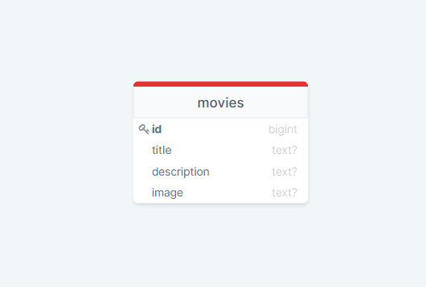

# The Good, the Bad & the Ugly

This applications is written on  pure Vanila Php. For Studing purposes The Idea of the Application is fairly simple. 
I's an application about movies, where user can make some CRUD operations. add movie, update movie, update movie image and so on.

This repository contains Three versions of the same app.  

* The Good - in this version I have imitated popular framework. I have implemented my own Routing & MVC architecture. 
* The Bad  - here application has good file structure, I've written  reusable code and it's way clearner and better then the Ugly version;
* The Ugly - This is the way a beginner would do it, with a lot of code repetition and brute force.

## Getting Started

1.  go to the directory where you want to have a folder containing this repository, and execute;
```
git clone https://github.com/BekaBadzagua/good-bad-ugly
```

2. Create Database with following simple structure



## :cowboy_hat_face: The Good

3.1 Go to the root folder of the repository and execute:
```
cd 1_good
composer install
```

3.2 Run local server
```
php -S localhost:8000 -t .
```

3.3 Visit this page in the browser
```
http://localhost:8000/public/
```

## :smiling_imp: The Bad

3.1 Go to the root folder of the repository and execute:
```
cd 2_bad
```

3.2 Run local server
```
php -S localhost:8000 -t .
```

3.3 Visit this page in the browser
```
http://localhost:8000/public/pages
```

## :monkey: And The Ugly

3.1 Go to the root folder of the repository and execute:
```
cd 3_ugly
```

3.2 Run local server
```
php -S localhost:8000 -t .
```

3.3 Visit this page in the browser
```
http://localhost:8000/
```